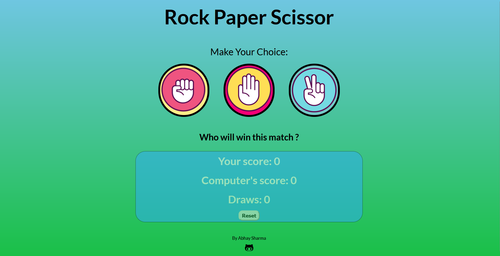

<div align="center">

  <h2 align="center">Rock, Paper, Scissors Game 🎮</h2>

In this project, I have created a **Rock, Paper, Scissors** game using HTML, CSS & JavaScript.  
It’s a fun, responsive browser-based game where you can play against the computer with real-time feedback and score tracking.

</div>

---

### 🖼️ Demo Screenshot



---

### 🛠️ Tech Stack

- HTML5
- CSS3
- JavaScript
- VS Code
- GitHub Pages

---

### 🚀 Features

- Classic Rock, Paper, Scissors gameplay
- Random computer move generator
- Real-time score tracking for wins, losses, and draws
- Intuitive and interactive user interface
- Fully responsive layout for desktop and mobile devices

---

### 🕹️ How to Play

1. Click on **Rock**, **Paper**, or **Scissors** to make your move
2. The computer will randomly select its move
3. The result of the round will appear instantly
4. The score will keep updating — try to beat the computer!

---

### 💻 Run Locally

To run **rock-paper-scissors-game** locally, follow these steps:

Linux and macOS:

```
```bash
sudo git clone https://github.com/Abhay19sharma/Rock-Paper-Scissors-game

Windows:

```bash
git clone https://github.com/Abhay19sharma/Rock-Paper-Scissors-game
```

### Contact

If you have any questions, suggestions, or feedback, you can reach out to the project maintainer:

- Name : [Abhay Sharma](https://www.linkedin.com/in/abhay-sharma-314830283)
- Email: [as.abhaysharma19@gmail.com](mailto:as.abhaysharma19@gmail.com)

---

### License

This project is licensed under the [MIT License](LICENSE). Feel free to use the code for personal or commercial purposes.
